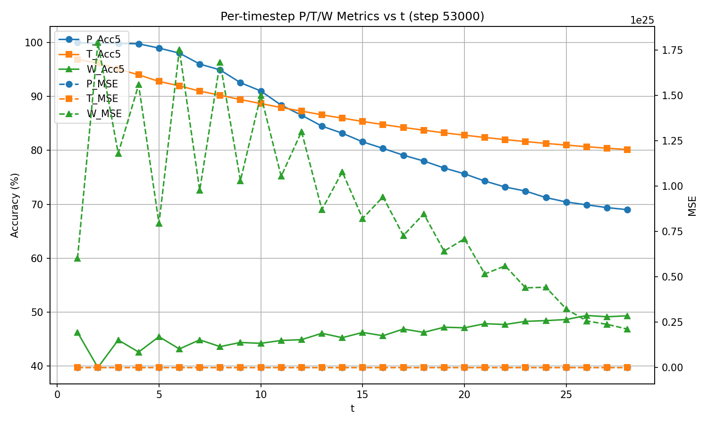
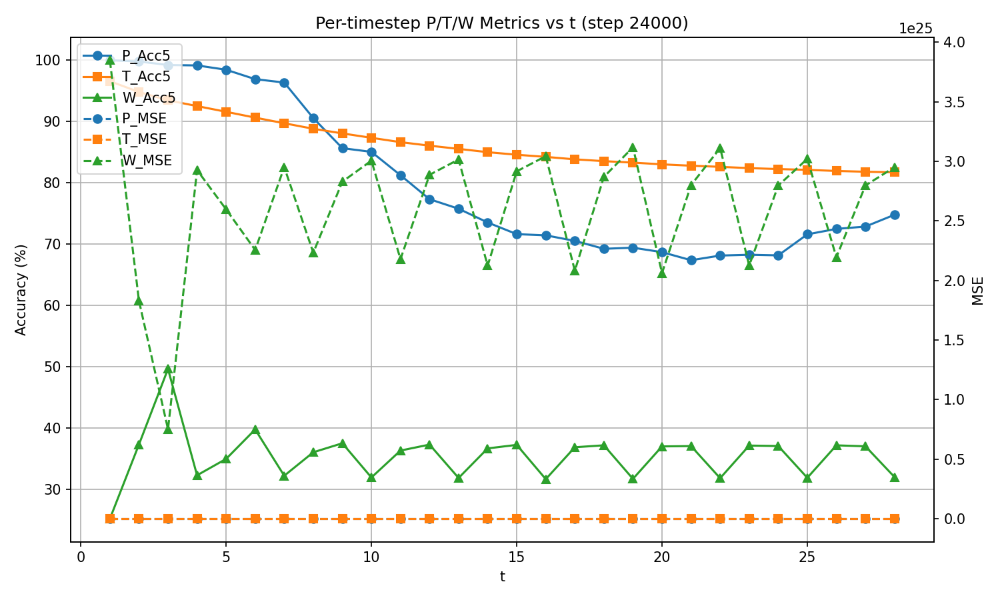

# VoxelNet Geothermal

A 3D Convolutional Neural Network for autoregressive prediction of pressure, temperature, and well energy production (WEPT) in geothermal reservoir simulations.

## Overview

This model predicts temporal evolution of geothermal reservoir properties over 30 time steps (years) using a residual-predicting architecture. Given static geological properties and dynamic states at times t-1 and t, it predicts the change (delta) from t to t+1.

**Key Features:**
- 3D CNN with configurable receptive field radius (default: r=5 for 11x11x11 kernel)
- Residual prediction (predicts deltas, not absolute values)
- Scheduled sampling for stable autoregressive training
- Supports distributed training across multiple GPUs

## Model Performance

Evaluation on 5 held-out test files (v2.5_0001.h5 to v2.5_0005.h5), 28-step autoregressive rollout:

| Model | Kernel | Params | Time/file | ACC P | ACC T | MSE P | MSE T |
|-------|--------|--------|-----------|-------|-------|-------|-------|
| **best_r2_step24000.pt** | 5x5x5 | 309K | 13s | 80.1% | 86.3% | **12.7** | 45.9 |
| best_r5_step53000.pt | 11x11x11 | 849K | 15s | **84.1%** | **86.7%** | 20.5 | **35.8** |
| Copy baseline | - | 0 | 0s | 46.3% | 83.9% | 121.1 | 139.1 |
| Linear baseline | - | 120 | 0.4s | 40.4% | 62.8% | 114.1 | 166.8 |

**Accuracy Thresholds (ACC_ABS):**
- Pressure: +/- 5 bar
- Temperature: +/- 5 C

**Baselines:**
- **Copy baseline**: Predicts delta=0 (propagates initial values forward unchanged)
- **Linear baseline**: Untrained 1x1x1 convolution (per-voxel linear regression)

**Notes:**
- Time/file measures model forward pass only (28 steps), excludes file I/O
- r=2 model is recommended: smaller, faster, and lowest pressure MSE
- Both trained models significantly outperform baselines on pressure prediction

### Per-Timestep Metrics

The plots below show accuracy and MSE metrics at each timestep during the 28-step autoregressive rollout. Accuracy (solid lines, left axis) shows the percentage of predictions within the absolute threshold. MSE (dashed lines, right axis) shows mean squared error.

**r=5 Model (best_r5_step53000.pt):**



**r=2 Model (best_r2_step24000.pt):**



## Pretrained Model Details

Two pretrained checkpoints are included:
- `best_r2_step24000.pt` - **Recommended**: Smaller model (5x5x5 kernel), lowest pressure MSE
- `best_r5_step53000.pt` - Larger model (11x11x11 kernel), higher accuracy but larger MSE

Both were trained with similar configuration:

### Architecture
| Parameter | r=2 Model | r=5 Model | Description |
|-----------|-----------|-----------|-------------|
| **Receptive Field Radius** | 2 | 5 | Kernel = 2*r+1 |
| **Kernel Size** | 5x5x5 | 11x11x11 | Spatial receptive field |
| **Stride** | 1 | 1 | All convolutions |
| **Padding** | 2 (same) | 5 (same) | Output = input size |
| **Base Channels** | 32 | 32 | Feature width |
| **Depth** | 4 | 4 | Residual blocks |
| **Grid Size** | 326x70x76 | 326x70x76 | (D x H x W) voxels |
| **Input Channels** | 14 | 14 | 8 static + 6 dynamic |
| **Output Channels** | 3 | 3 | Delta P, T, WEPT |
| **Total Parameters** | 309K | 849K | Model size |

### Training Configuration
| Parameter | Value | Description |
|-----------|-------|-------------|
| **Optimizer** | AdamW | Adam with decoupled weight decay |
| **Learning Rate** | 0.001 | Constant after warmup |
| **Weight Decay** | 0.01 | L2 regularization |
| **Warmup Steps** | 10 | Linear LR warmup |
| **LR Schedule** | Constant | No decay after warmup |
| **Batch Size** | 4 per GPU | 36 effective (9 GPUs) |
| **Gradient Accumulation** | 1-3 | Varied during training |
| **Training Steps** | 24K (r=2), 53K (r=5) | Training iterations |
| **GPUs** | 9x NVIDIA A100/A40 | Distributed Data Parallel |

### Key Design Choices
| Feature | Value | Why |
|---------|-------|-----|
| **Prediction Type** | Residuals (deltas) | Smaller magnitudes, easier to learn, more stable rollouts |
| **Lookback Context** | 2 timesteps | Uses both t-1 and t to predict t+1 |
| **Scheduled Sampling** | Yes (80% final) | Model sees its own predictions during training for stable rollouts |
| **Sched. Samp. Start** | 85% Acc5 | Begin mixing predictions when accuracy reaches 85% |
| **Sched. Samp. End** | 95% Acc5 | Reach final probability at 95% accuracy |
| **Loss Function** | MSE | Separate losses for P, T, WEPT |
| **Normalization** | Z-score | Per-channel mean/std from training data |
| **Mixed Precision** | No | Full FP32 training |

### Data Split
- **Training Set**: 444 simulations (v2.5_0006.h5 to v2.5_0449.h5)
- **Test Set**: 5 simulations (v2.5_0001.h5 to v2.5_0005.h5)
- **Time Steps per Simulation**: 30 (years)
- **Samples per Epoch**: ~12,000 (444 files x ~28 valid timesteps)

## Data Format

The model expects H5 files with the following structure:

```
Input/
  FaultId: (D, H, W) - Fault zone ID
  InjRate: (D, H, W) - Injection rate
  IsActive: (D, H, W) - Active cell mask
  IsWell: (D, H, W) - Well location mask
  PermX, PermY, PermZ: (D, H, W) - Permeability
  Porosity: (D, H, W) - Porosity
  Pressure0: (D, H, W) - Initial pressure
  Temperature0: (D, H, W) - Initial temperature
  ParamsScalar: (26,) - Scalar parameters

Output/
  Pressure: (T, D, H, W) - Pressure over time
  Temperature: (T, D, H, W) - Temperature over time
  WEPT: (T, D, H, W) - Well energy production total
```

Where D=326, H=70, W=76 for v2.5 data, and T=30 time steps.

## Installation

```bash
# Clone the repository
git clone https://github.com/Fchaubard/voxelnet_geothermal.git
cd voxelnet_geothermal

# Create virtual environment
python -m venv venv
source venv/bin/activate  # Linux/Mac
# or: venv\Scripts\activate  # Windows

# Install dependencies
pip install -r requirements.txt
```

## Download Data

Download the sample H5 files from Google Drive:

**[Download Data (Google Drive)](https://drive.google.com/drive/folders/1CqXxoEauRxgvNbHOnKDVaLhkRWTlsXsg)**

Place the downloaded `.h5` files in the `sample_data/` directory:

```bash
mkdir -p sample_data
# Move downloaded files to sample_data/
mv ~/Downloads/v2.5_*.h5 sample_data/
```

Your directory should look like:
```
voxelnet_geothermal/
  sample_data/
    v2.5_0001.h5
    v2.5_0002.h5
    ...
```

## Quick Start: Running Inference

Run inference on the downloaded sample files:

```bash
python scripts/rollout.py \
    --checkpoint checkpoints/best_r5_step53000.pt \
    --stats_path data/stats.json \
    --raw_h5_dir sample_data \
    --test_files v2.5_0001.h5 \
    --max_steps 29 \
    --device cuda:0
```

**Example output:**
```
Loading checkpoint from checkpoints/best_r5_step53000.pt...
Created VoxelAutoRegressor model with base_channels=32, r=5 (kernel 11x11x11)
Loaded model from step 53000
Model parameters: 849,000

Running rollout evaluation on 2 files:
  - v2.5_0001.h5
  - v2.5_0002.h5

Starting 29-step rollout evaluation...
Rollout evaluation completed in 96.0s

============================================================
ROLLOUT EVALUATION RESULTS (step 53000)
============================================================
  [ROLLOUT 29-step] MSE - P:2.049e+01 T:3.580e+01 WEPT:8.869e+24
  [ROLLOUT 29-step] ACC5 - P:0.8411 T:0.8672 WEPT:0.4596
============================================================
```

## Training a New Model

### 1. Prepare Your Data

Place H5 files in a directory following the format above. Files should be named like `v2.5_0001.h5`, `v2.5_0002.h5`, etc.

### 2. Compute Normalization Statistics

```bash
python scripts/compute_stats.py \
    --h5_dir /path/to/h5_data \
    --output data/stats.json \
    --num_files 100
```

### 3. Launch Distributed Training

Edit `launch_training.sh` to set your paths, then:

```bash
./launch_training.sh
```

Or run directly:

```bash
CUDA_VISIBLE_DEVICES=0,1,2,3,4,5,6,7,8 python -m torch.distributed.run \
    --nproc_per_node=9 \
    --master_port=29500 \
    scripts/train_ddp.py \
    --raw_h5_mode \
    --raw_h5_dir /path/to/h5_data \
    --stats_path data/stats.json \
    --batch_size 4 \
    --num_workers 0 \
    --receptive_field_radius 5 \
    --base_channels 32 \
    --depth 4 \
    --lr 0.001 \
    --weight_decay 0.01 \
    --warmup_steps 10 \
    --max_steps 100000 \
    --accum_steps 1 \
    --log_every 1 \
    --eval_every 1000 \
    --ckpt_every 1000 \
    --save_dir checkpoints \
    --predict_residuals \
    --scheduled_sampling \
    --sched_samp_final_prob 0.80 \
    --use_wandb \
    --wandb_project "voxel-ode-v25"
```

### Key Training Arguments

| Parameter | Default | Description |
|-----------|---------|-------------|
| `--receptive_field_radius` | 5 | Kernel size = 2*r+1 (5 gives 11x11x11) |
| `--base_channels` | 32 | Feature channel width |
| `--depth` | 4 | Number of residual blocks |
| `--batch_size` | 4 | Per-GPU batch size |
| `--lr` | 0.001 | Learning rate |
| `--scheduled_sampling` | flag | Enable scheduled sampling for stable rollouts |
| `--sched_samp_final_prob` | 0.8 | Final probability of using model predictions during training |
| `--predict_residuals` | flag | Predict deltas instead of absolute values |

## Model Architecture

The `VoxelAutoRegressor` is a 3D CNN with:

- **Stem**: Large kernel convolution (configurable receptive field)
- **Trunk**: Stack of residual blocks with LayerNorm and SiLU activations
- **FiLM conditioning**: Scalar parameters modulate features via learned bias
- **Dual heads**: Grid prediction head (3 channels) + scalar prediction head (5 values)

**Input channels (14 total):**
- 8 static features: FaultId, InjRate, IsActive, IsWell, PermX, PermY, PermZ, Porosity
- 3 from t-1: Pressure, Temperature, WEPT (zeros for first step)
- 3 from t: Pressure, Temperature, WEPT

**Output (residuals):**
- Delta Pressure (t to t+1)
- Delta Temperature (t to t+1)
- Delta WEPT (t to t+1)

## Project Structure

```
voxelnet_geothermal/
  checkpoints/
    best_r2_step24000.pt     # Recommended: smaller, lowest pressure MSE
    best_r5_step53000.pt     # Larger model, higher accuracy
  data/
    stats.json               # Normalization statistics
  plots/
    rollout_metrics_step24000.png  # Per-timestep metrics for r=2 model
    rollout_metrics_step53000.png  # Per-timestep metrics for r=5 model
    rollout_metrics_stepcopy.png   # Copy baseline metrics
    rollout_metrics_steplinear.png # Linear baseline metrics
  sample_data/               # Download from Google Drive (see above)
    v2.5_0001.h5             # Sample validation files
    v2.5_0002.h5
    ...
  notebooks/
    analyze_h5_v2.5_fixed.ipynb    # Data exploration notebook
    model_error_analysis.ipynb      # Error analysis notebook
  scripts/
    train_ddp.py             # Distributed training script
    rollout.py               # Inference/evaluation script
    evaluate.py              # Detailed single-file evaluation
    compute_stats.py         # Compute normalization stats
    check_h5_integrity.py    # Validate H5 file structure
  voxel_ode/
    model.py                 # VoxelAutoRegressor model
    dataset.py               # Data loading and caching
    data_prep.py             # Data preparation utilities
    file_aware_sampler.py    # Multi-file sampling
    schedulers.py            # Learning rate schedulers
    utils.py                 # Utility functions
  requirements.txt
  launch_training.sh
```

## Notebooks

- **analyze_h5_v2.5_fixed.ipynb**: Explore the H5 data format, visualize static and dynamic features, understand data distributions
- **model_error_analysis.ipynb**: Analyze model predictions vs ground truth, visualize errors per time step, identify failure modes

## Troubleshooting

**Out of Memory:**
- Reduce `--batch_size` (try 2 or 1)
- Reduce `--receptive_field_radius` (try 2 for 5x5x5 kernel)
- Reduce `--base_channels` (try 16)

**Slow Training:**
- Ensure GPU is being used (`nvidia-smi` should show utilization)
- Use `--num_workers 0` for H5 files (H5 doesn't parallelize well)
- Increase `--batch_size` if GPU memory allows

**Poor Accuracy:**
- Train longer (at least 20K+ steps)
- Enable scheduled sampling (`--scheduled_sampling`)
- Increase `--sched_samp_final_prob` (try 0.8-0.9)

## License

MIT License

## Citation

If you use this code, please cite:

```bibtex
@software{voxelnet_geothermal,
  title = {VoxelNet Geothermal: 3D CNN for Reservoir Simulation},
  year = {2024},
  url = {https://github.com/Fchaubard/voxelnet_geothermal}
}
```
